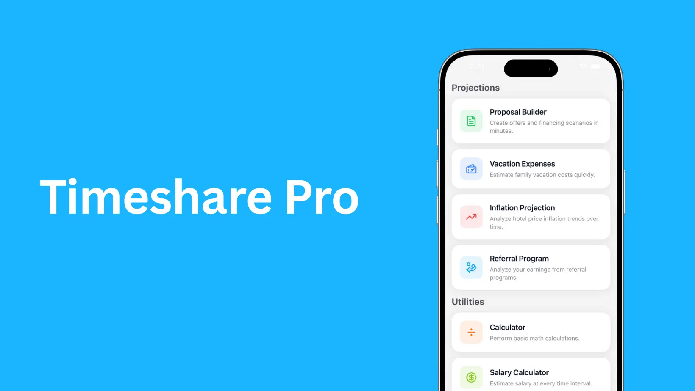

# Timeshare Pro Landing Page

Static marketing site for the Timeshare Pro sales toolkit. The page highlights the mobile app’s calculators, includes a Formspree-powered support form, and documents the service’s Terms of Service and Privacy Policy. Two implementations are available:

- `index.html`: single-file version that pulls Tailwind CSS from the CDN for instant previews.
- `src/main.ts`: TypeScript/Vite-friendly entry point that renders the same markup and handles the dynamic copyright year.

## Highlights

- Responsive hero with App Store / Google Play call-to-actions and a mock device image (`mockup.png`).
- Feature grid covering mortgage proposals, inflation projections, referrals, salary breakdowns, calculators, and theme support.
- Support/contact section that posts to Formspree (`https://formspree.io/f/xdkjvykw`) and includes consent copy.
- Legal copy blocks for Terms of Service and Privacy Policy, each stamped with the latest update date.
- Lightweight styling via Tailwind utility classes plus a minimal base stylesheet (`styles.css`) for typography defaults.

## Quick Start

1. Clone or download this repo.
2. Open `index.html` directly in your browser **or** serve the folder to avoid any asset/CORS restrictions, e.g.:
   ```bash
   npx serve .
   # or
   python3 -m http.server 4173
   ```
3. Visit `http://localhost:4173` (or the port printed in your terminal).

The CDN build of Tailwind CSS is referenced in `index.html`, so there is no install step required for basic edits. If you want to integrate the TypeScript entry point with Vite or another bundler, run `npm install` in your preferred toolchain and point it at `src/main.ts`.

## Project Structure

| Path           | Purpose                                                                                                                              |
| -------------- | ------------------------------------------------------------------------------------------------------------------------------------ |
| `index.html`   | Production-ready single page using Tailwind CDN.                                                                                     |
| `preview.html` | Alternate prototype wired to a precompiled Tailwind file (`./css/tailwind.css`). Useful if you want to bring your own design system. |
| `src/main.ts`  | Renders the landing page in a Vite/TypeScript environment and updates the footer year dynamically.                                   |
| `styles.css`   | Minimal global styles (font stack, smoothing) shared by `index.html`.                                                                |
| `mockup.png`   | Device illustration displayed in the hero.                                                                                           |

## Customizing

- **Branding:** Update logos/text in the hero and footer, swap `mockup.png`, and tweak CTA button labels/links.
- **Contact form:** Replace the Formspree endpoint in both `index.html` and `src/main.ts` with your own form handler.
- **Copy:** Hero messaging, feature descriptions, Terms, and Privacy sections are plain HTML—adjust or localize as needed.
- **Styling:** Tailwind classes can be edited inline; for larger changes, connect the project to a proper Tailwind build pipeline using `preview.html` as a starting point.

## Deployment

Because everything is static, you can deploy this site anywhere that serves HTML:

- Upload the files to S3/CloudFront, Netlify, Vercel, GitHub Pages, etc.
- Ensure `mockup.png`, `favicon.ico`, and any custom assets are uploaded alongside the HTML.
- If you host behind HTTPS, keep the Formspree endpoint (`https://...`) to avoid mixed-content warnings.

That’s it—you now have a ready-to-publish landing page describing the Timeshare Pro toolkit.
